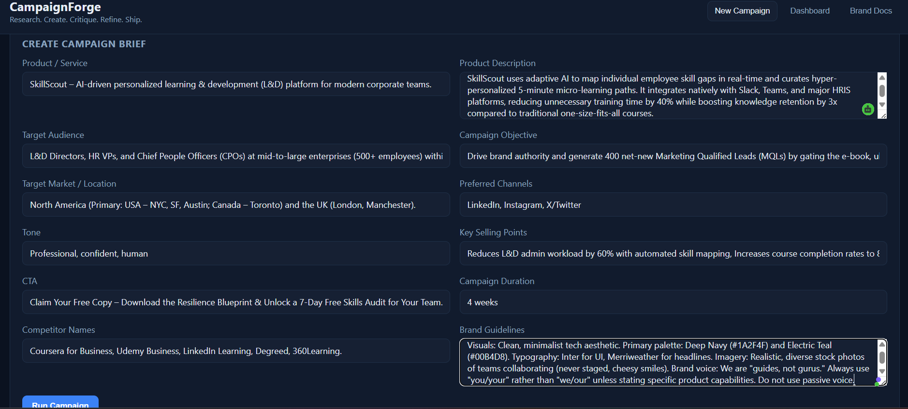
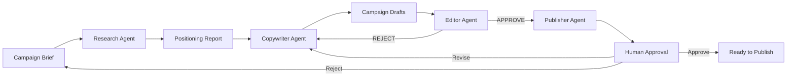

# CampaignForge — Multi-Agent AI Marketing Crew

> Research. Create. Critique. Refine. Ship.

CampaignForge is a production-oriented multi-agent AI system that transforms a marketing brief into evidence-backed, brand-compliant campaign assets using specialized autonomous agents.

## 1. Problem

Marketing teams spend hours researching competitors, drafting copy across platforms, enforcing brand guidelines, and iterating with stakeholders. Tools today either:
- Generate generic copy with no brand grounding,
- Scrape competitors without attribution,
- Skip quality control,
- Or require manual orchestration across multiple disconnected tools.

## 2. Solution

CampaignForge coordinates four specialized agents through a controlled, auditable workflow:

1. **Research Agent** — gathers market trends, competitor positioning, keyword opportunities, and audience pain points.
2. **Copywriter Agent** — generates multiple creative variants grounded in verified brand claims.
3. **Editor Agent** — applies deterministic checks and AI reasoning to enforce quality, platform limits, and brand compliance.
4. **Publisher Agent** — packages approved assets into exportable formats.

Every externally researched claim preserves its source. Brand information is retrieved through a dedicated knowledge base. The system never invents product claims.



## 3. Why Multi-Agent Architecture

A single LLM call cannot reliably:
- Enforce brand constraints,
- Track citations,
- Detect unsupported claims,
- Retry revisions within limits,
- Or persist state across a long campaign workflow.

By separating concerns into explicit agents with typed handoffs, CampaignForge achieves:
- **Deterministic quality gates** at every transition,
- **Structured, validated outputs** between agents,
- **Observability** of agent timing, retries, and token usage,
- **Human-in-the-loop approval** before publishing.

## 4. Architecture



## 5. Agent Responsibilities

| Agent | Responsibility |
|-------|---------------|
| Research | Market trends, competitor positioning, keyword opportunities, pain points |
| Copywriter | Generate variants across platforms (LinkedIn, Instagram, X/Twitter, Landing Page, Ads, Email) using structured frameworks (AIDA, PAS, FAB, BAB, Problem/Solution) |
| Editor | Deterministic checks (character limits, empty fields, readability) + AI reasoning (generic language, missing benefits) |
| Publisher | Format assets, generate export packages (JSON, Markdown, CSV) |

## 6. Agent Handoffs

All handoffs use Pydantic schemas:
- `CampaignBrief` → Research Agent
- `ResearchReport` → Copywriter Agent
- `CopyVariant[]` → Editor Agent
- `EditorialReview` → Copywriter Agent (on rejection) or Publisher Agent (on approval)
- `CampaignAsset[]` → Human Approval

## 7. RAG / Brand Memory

Documents are ingested through a pipeline:
1. Extraction
2. Cleaning
3. Chunking
4. Embedding (SentenceTransformers)
5. FAISS vector storage
6. Semantic retrieval

Supported documents:
- Brand guidelines
- Product documentation
- Tone-of-voice guidelines
- Approved claims
- Customer personas
- Previous campaigns
- Product FAQs
- Competitor research

Retrieval results preserve source citations. Agents retrieve relevant brand information before generating assets.

## 8. Research Workflow

The Research Agent supports configurable web search providers:
- Tavily
- Serper
- Demo mode (when no API key is configured)

When no search API is available, the agent derives insights from the Brand Knowledge Base and clearly labels the research mode as `demo`. It never fabricates sources.

Output includes:
- Market Position
- Target Audience Insights
- Pain Points
- Competitor Messaging
- Market Trends
- Keyword Opportunities
- Differentiation Opportunities
- Risks
- Sources
- Confidence

## 9. Editor Quality Gate

The Editor Agent combines:
- **Deterministic validation**: character count, word count, required CTA presence, prohibited terms, required keywords, duplicate content, empty fields, platform-specific limits, readability metrics.
- **AI reasoning**: overly generic language, missing benefits, unsupported claims.

Findings are tagged `deterministic` or `ai_derived` with severity `error`, `warning`, or `info`.

## 10. Human Approval

After editorial approval, the campaign moves to human review. The dashboard displays:
- Research summary and sources
- Audience and strategy
- Generated variants with platform and framework
- Editor results and revisions
- Final assets

Actions:
- **Approve** → exports as JSON, Markdown, or CSV
- **Request Revision** → returns to Copywriter with editor feedback
- **Reject** → resets campaign to DRAFT

## 11. Evaluation

A reproducible evaluation framework measures:
- Research: source validity, evidence coverage, relevance
- RAG: retrieval relevance, citation correctness
- Copywriter: brand alignment, audience alignment, content quality
- Editor: constraint detection, unsupported claim detection, revision quality
- Workflow: completion rate, revision count, latency

## 12. Guardrails

- No hallucinated product claims (prefer "Insufficient evidence")
- No fabricated statistics or sources
- Bounded revision loops (configurable max, default 3)
- Timeouts on all LLM and web search calls
- Bounded retries with exponential backoff
- API errors do not expose stack traces
- Uploaded documents are validated for size and type
- Publishing requires explicit human approval
- Prompt injection from documents is handled by retrieval isolation

## 13. Observability

Structured logs track:
- Agent execution time
- Model latency
- Tool calls
- Retrieval latency
- Web searches
- Revision count
- Editor rejection rate
- Total campaign generation time

API keys and sensitive credentials are never logged.

## 14. Tech Stack

- **Backend**: FastAPI, Python 3.11+, Pydantic
- **LLM**: Ollama (local, optional OpenAI-compatible providers)
- **Embeddings**: SentenceTransformers (`all-MiniLM-L6-v2`)
- **Vector Store**: FAISS (drop-in replacement for ChromaDB)
- **Frontend**: Vanilla HTML/CSS/JS
- **Orchestration**: Custom state graph (LangGraph-compatible pattern)

## 15. Installation

```bash
git clone <repo>
cd campaignforge
cp .env.example .env
uv sync
```

## 16. Environment Variables

| Variable | Default | Description |
|----------|---------|-------------|
| `OLLAMA_HOST` | `http://localhost:11434` | Ollama API endpoint |
| `OLLAMA_MODEL` | `llama3.1:8b` | Model name |
| `EMBEDDING_MODEL` | `all-MiniLM-L6-v2` | Sentence transformer |
| `WEB_SEARCH_PROVIDER` | `demo` | `tavily`, `serper`, or `demo` |
| `TAVILY_API_KEY` | _(empty)_ | Optional |
| `SERPER_API_KEY` | _(empty)_ | Optional |
| `MAX_CAMPAIGN_REVISIONS` | `3` | Max copywriter revisions |
| `CAMPAIGN_STORE_PATH` | `./campaigns` | Persistence path |

## 17. Running Locally

### Start Ollama
```bash
ollama serve
ollama pull llama3.1:8b
```

### Start Backend
```bash
cd backend
uv run fastapi dev app.py
```

### Start Frontend
The frontend is served automatically by the FastAPI backend at `http://localhost:8000`.

### Ingest Brand Documents
```bash
mkdir -p docs/brand
# Copy your brand documents into docs/brand/
# The server ingests them on startup
```

## 18. Example Campaign

```json
{
  "product_service": "AI Productivity Platform",
  "product_description": "Automate tasks for small businesses.",
  "target_audience": "Small business owners",
  "campaign_objective": "Generate qualified leads",
  "target_market": "North America",
  "preferred_channels": ["LinkedIn", "Instagram", "X/Twitter"],
  "tone": "Professional, confident, human",
  "key_selling_points": ["Save 10+ hours/week", "Increase retention 25%"],
  "cta": "Book a demo",
  "campaign_duration": "4 weeks",
  "competitor_names": ["CompetitorA", "CompetitorB"]
}
```

This triggers the full Research → Positioning → Copywriting → Editing → Revision → Approval → Export workflow.

## 19. Testing

```bash
pytest tests/ -v
```

Test coverage includes:
- RAG retrieval
- Citation validation
- Brand claim verification
- Agent schema validation
- Deterministic platform limits
- Editor rejection
- Revision loop
- Maximum retry count
- Campaign state transitions
- Web search failure
- LLM failure
- Human approval
- Export generation

## 20. Limitations

- Live web research requires Tavily or Serper API keys; otherwise the system runs in `demo` mode.
- The Copywriter Agent relies on Ollama tool calling; very small models may not support structured JSON outputs reliably.
- Publishing integrations (Buffer, WordPress, Mailchimp) are not implemented — export is local-only.
- The frontend is a minimal single-page application; production use should add authentication.

## 21. Future Improvements

- LangGraph state graph for visual workflow debugging
- Agent evaluation benchmark dataset with automated scoring
- Redis-backed campaign state for horizontal scaling
- Real publishing integrations (Buffer, WordPress, Mailchimp)
- Multi-user auth and campaign sharing
- A/B test variant generation
- Image asset generation integration
